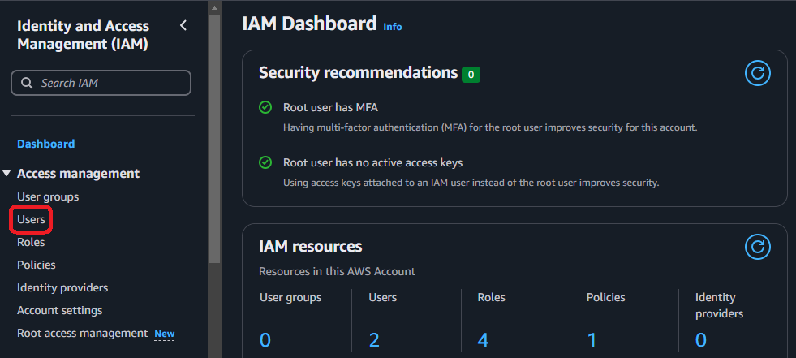
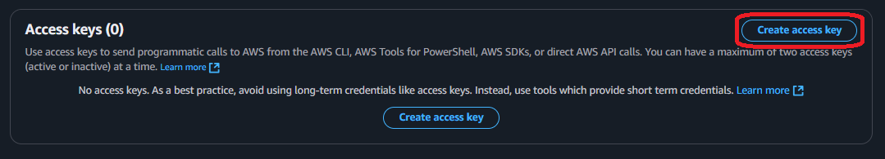
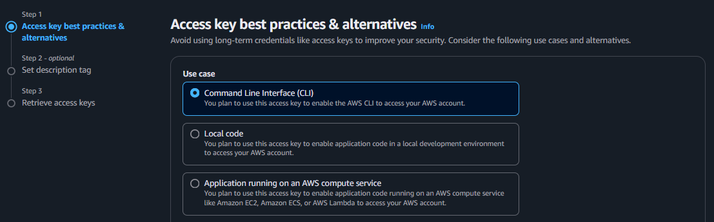
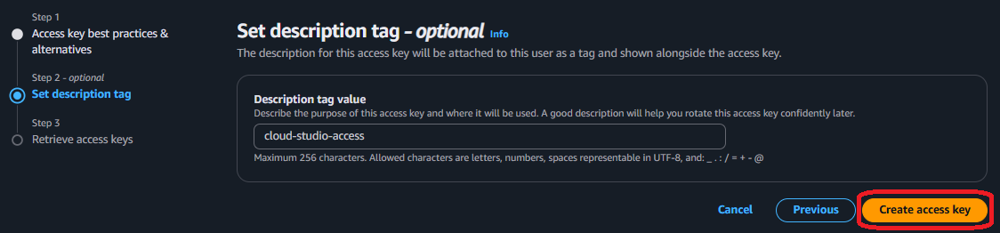

# How to generate credentials in AWS?

To access AWS, you generate credentials using **Identity and Access Management (IAM)**.

The credentials in AWS include ONE access key and ONE secret access key. And they can be created either by the ROOT user or a IAM user.

## Root user credentials (fast)

The fastest way to generate credentials in AWS services is through the root user, though it is not recommended for everyday use due to security concerns. 

::: warning
The root user has unrestricted access to all AWS resources and services, which makes it a powerful but risky option if compromised. Therefore, AWS strongly advises using the root user only for account setup and performing tasks that cannot be done by IAM users or roles.
:::

1. First go to the IAM console after logging in

2. Once you're in the dashboard go to "My security credentials" link

3. Scroll down to access keys section an click on "Create access key"

4. Ignore the danger, select the checkbox and click on "Create access key"

5. Copy both the "access key" and "secret access key" before leaving the page

## IAM user credentials (safe)

The safest way to generate credentials in AWS services is through a IAM user, since the have limited access to the AWS account and then their credentials are not as risky to lose. 

::: tip
The easiest way to grant access to a IAM user that will control all available resources on the AWS account is through the AdministratorAccess policy which restricts critical operations like changing billing or accounts.
:::

1. First go to the IAM console after logging in

2. Go to the users console using the link on the leftside menu

3. Create a new IAM user for administration

    

4. Provide a name and password for the new user, click "next"

5. Attach the "AdministratorAccess" policy to new user, click "next"

::: info
This policy grants full access to all AWS resources and services. If you assign this policy to the user, they can perform any action on any AWS service without restrictions.
:::

6. Review final details and confirm operation

7. Return to users list and click in the new user

8. Go to "security credentials" tab on new user details and click on "create access key"

9. Choose the "Command Line Interface" option, select the checkbox and click "next"

10. Add a description tag to the new credentials to identify them easily, confirm operation

11. Copy both the "access key" and "secret access key" before leaving the page

## Add secrets to CloudStudio

:::info
In case you have the AWS CLI installed and configured (with the same credentials extrated with the process above), then it's not necesary to load them on the environment secrets of CloudStudio
:::

1. Go to the Aws provider on the CloudStudio dashboard and click "add secret"

2. Copy the 2 keys, paste it on the access_key and secret_key values and apply changes

3. Finally set created secret to the current app environment

