# How to generate credentials in AZURE?

To access AZURE, you generate credentials using **Azure Active Directory (AAD)**.

The credentials in AZURE include FOUR values; a client id, a client secret, a tenant id and a subscription id. With the subscription id being interchangable within the same connection. 

## AAD and Subscriptions

The azure active directory is used for external applications (like CloudStudio) to access resources on a AZURE account, controling its access through roles and permissions.

:::info
An application is created in AAD, which generates a client_id and allows a client_secret to be configured.
And also this application is tied to a specific tenant identified by the tenant_id.

- On the other hand the subscription_id refers to a unique identifier for an Azure subscription (which controls billing, cost management, access control, permission management, etc).
:::

1. First go to the "App registrations" console after logging in

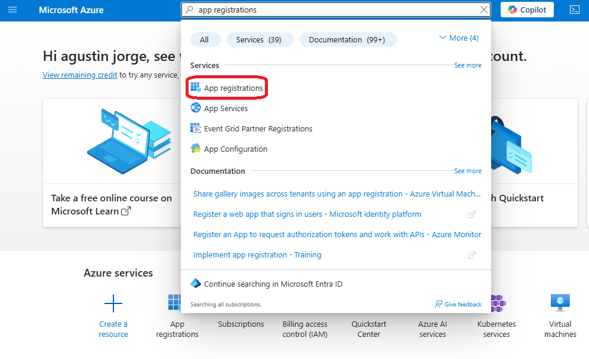

2. In the new opened console click "New registration" 

3. Give it a name, select "Accounts in any organizational directory" and click "Register"

4. Copy the Client_ID and the Tenant_ID in the application registered

5. Then go the "Certificates & Secrets" link in the Manage section on the leftside menu

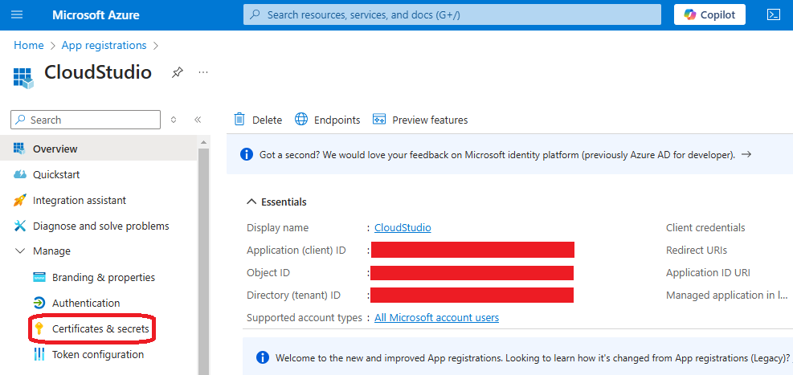

6. Click on the "New Client Secret" button

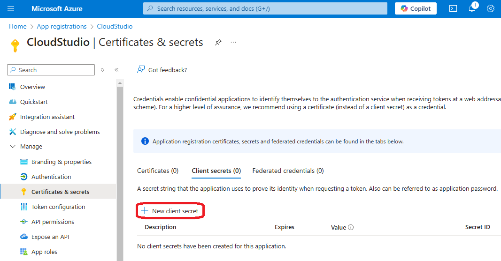

7. Give a description and a duration of your choice to the new secret, click "Add"

8. Copy the Client_SECRET generated for the application registered

9. Back to the Platform Dashboard go to the "Subscriptions"

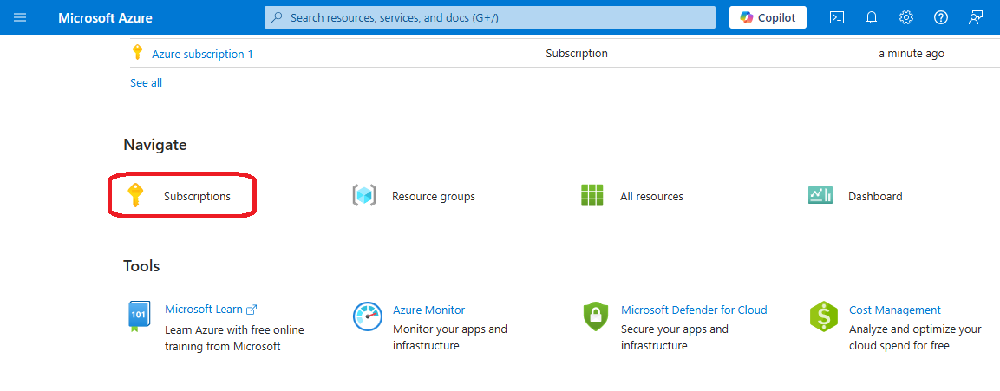

10. Click on a subscription of your choice (select the default of you haven't configured any)

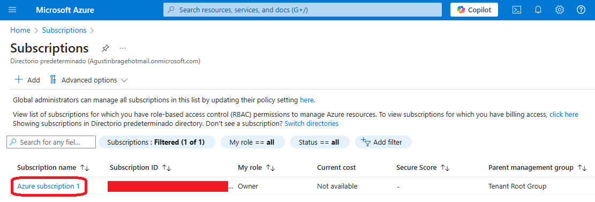

11. Copy the Subscription_ID that refers to the current subscription

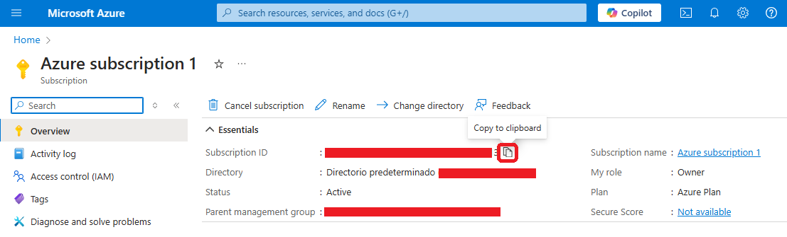

:::info Roles and Permissions
Now in order to be able to use the registered app and the chosen subscription to connect to azure resources, the app must have a CONTRIBUTOR role assigned to the same subscription.

- **So after copying all the keys and secrets, they won't work unless the app is added as CONTRIBUTOR on the role assignment list on the IAM panel of the subscription.**
:::

12. Go to "Access control (IAM)" link on the leftside menu

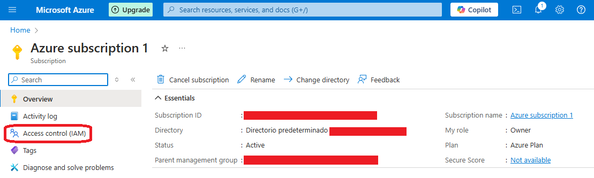

13. On the opened console click "Add" and then click "Add role assignment"

14. Choose the "contributor" role on the "Privileged administrator roles" section, click "next" 

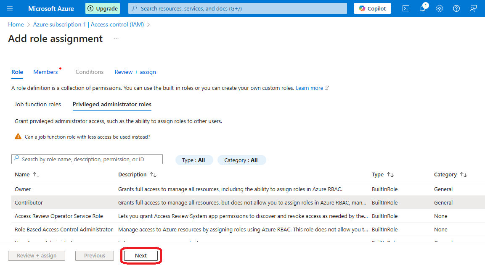

15. Choose the "User, group or service principal" option and click "Select members"

16. Search and select the app registered previously and click "Select"

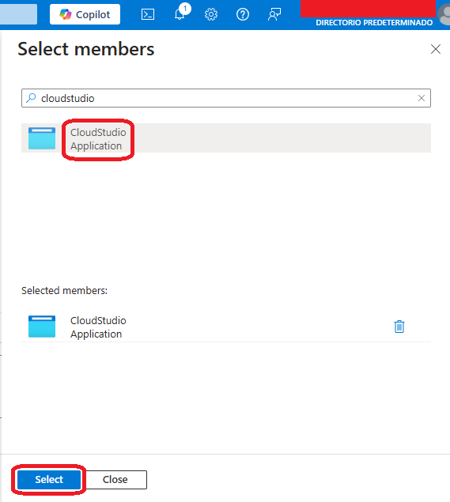

17. Add a description if you want to and click "next"

18. Check all the information and click "Review + assign"

## Add secrets to CloudStudio

:::info
In case you have the AZURE CLI installed and logged in (with the az login command), then it's not necesary to load the credentials on the environment secrets of CloudStudio.

- Perhaps you'd want to add only the subscription_id since it identifies a specific subscription within the account that changes depending on the needs of the project.
:::

1. Go to the Azure provider on the CloudStudio dashboard and click "add secret"

2. Copy the 4 keys, paste it on the default key-values and apply changes

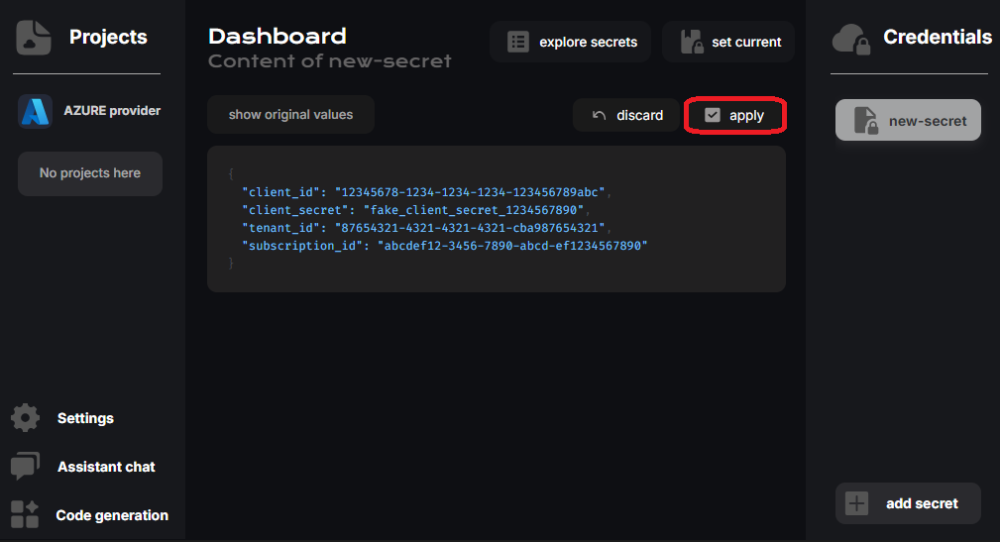

3. Finally set created secret to the current app environment

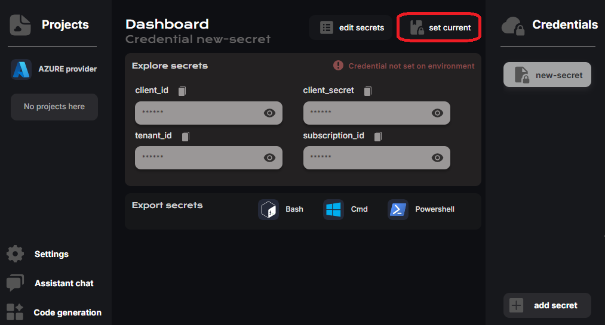

