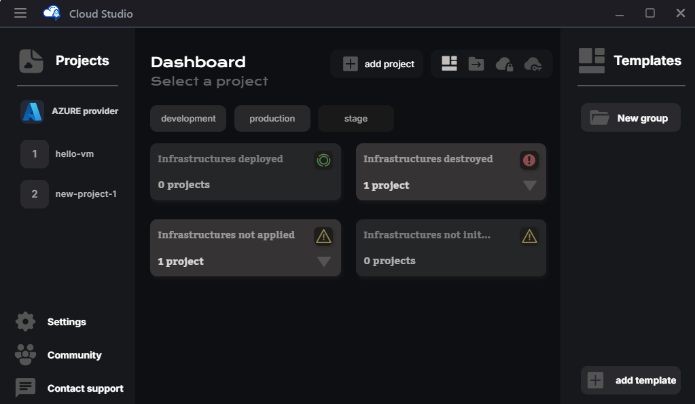
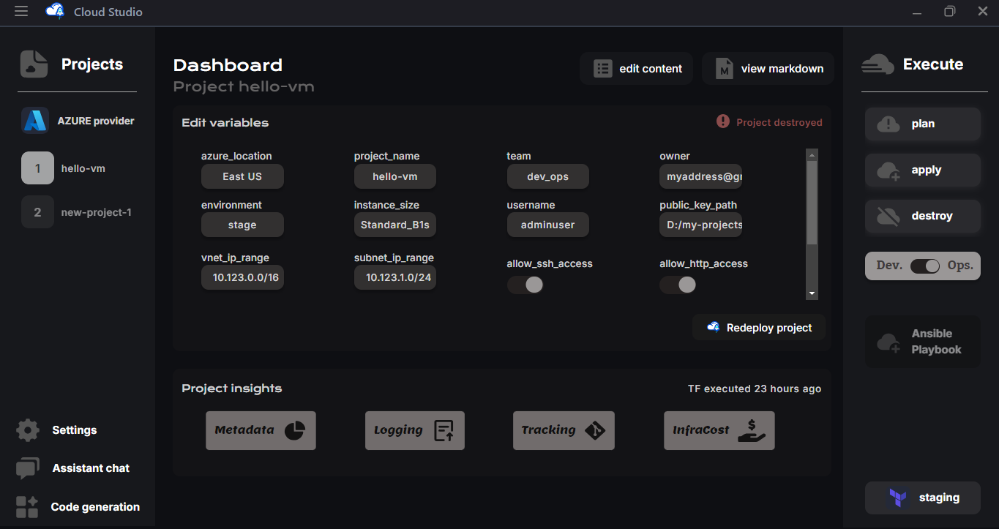
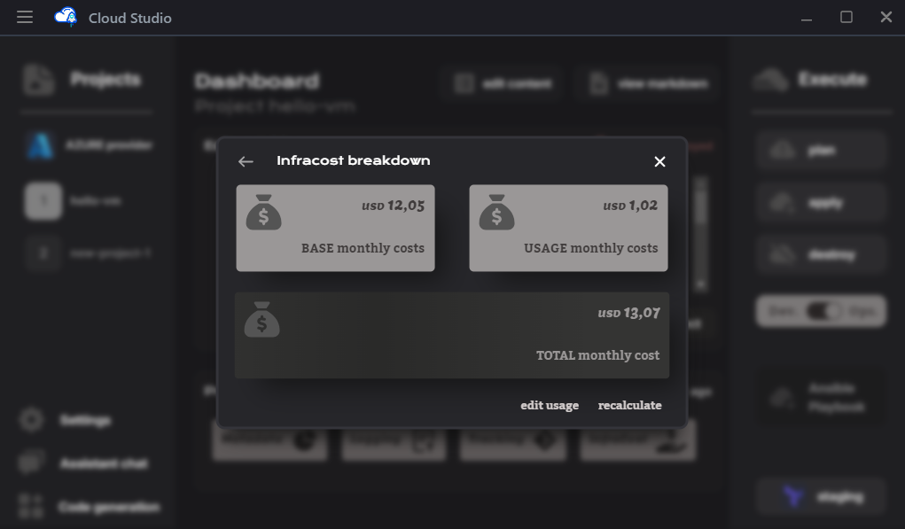

# Ejemplos

La aplicación de escritorio consiste en un panel de control intuitivo para navegar fácilmente entre `PROVEEDORES`, `PROYECTOS`, `MÓDULOS`, `PLANTILLAS`.

## Proveedores

En el panel de control principal, encontrarás el estado y versión de las herramientas requeridas por la app, al igual que las carpetas de los **PROVEEDORES** del "workdir".

## Proyectos

Cuando se selecciona un proveedor, se abrirá una nueva vista con todos los proyectos en el menú lateral, y los estados de los proyectos en el centro *(desplegado, destruido, etc)*. 

> *Además de los botones (íconos) para ir a plantillas, módulos, secretos y claves.*

Una vez seleccionado un proyecto, se mostrarán las variables del tfVars, y los botones para ejecutar commandos como **apply**, **plan**, **destroy**, **ansible-playbook**, y más. 

> *Incluyendo un botón de "desplegar proyecto" que ejecuta init, apply y ansible-playbook.*

## Código

En cada proyecto podés modificar el código en sus archivos principales, módulos y roles dentro de la estructura Terraform y Ansible creada por la aplicación. 

> *La aplicación genera todos los archivos y carpetas necesarias al crear el proyecto.*

## Ejecuciones

Después de iniciar la ejecución de un comando, el modal se abrirá mostrando su salida.

> *La ejecución puede ser cancelada y minimizada en cualquier momento.*

## Desglose de costos

Adicionalmente podés desglosar los costos del proyecto y estimar precios con Infracost.

> *En el desglose se mostrarán los precios base, por uso y totales mensuales.*

> *Además podés seleccionar uno de estos y ver el JSON procesado con la información.*

