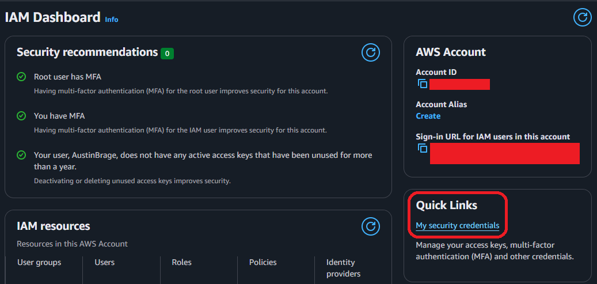
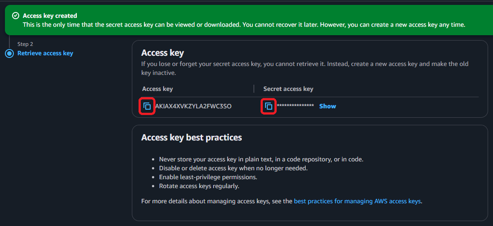
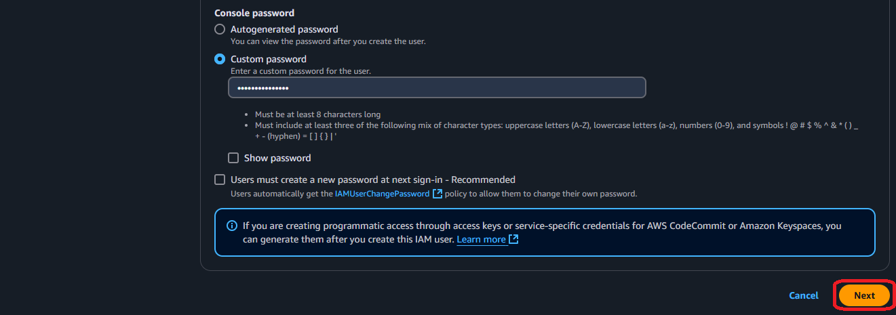
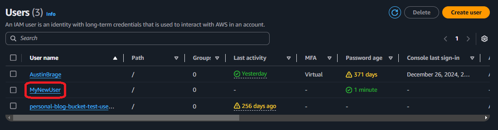
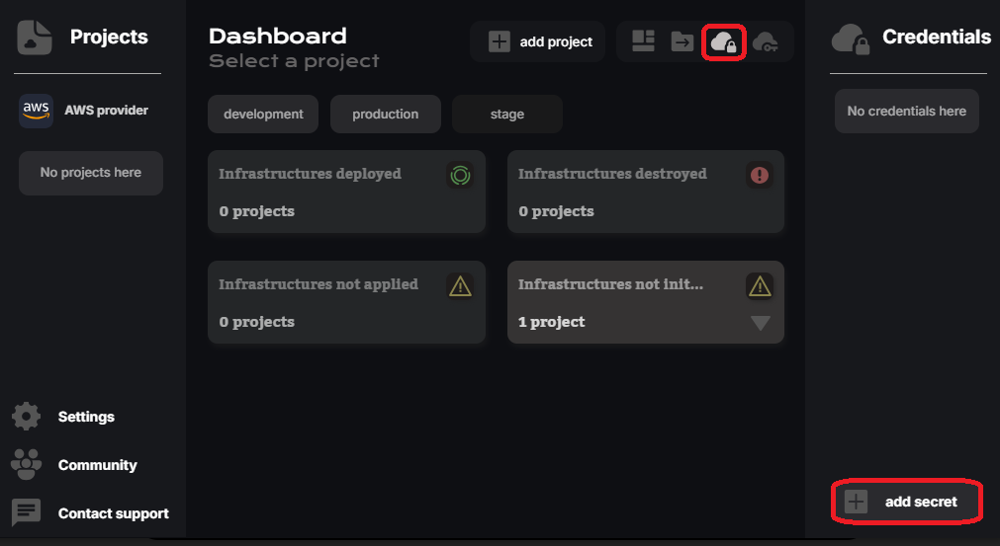
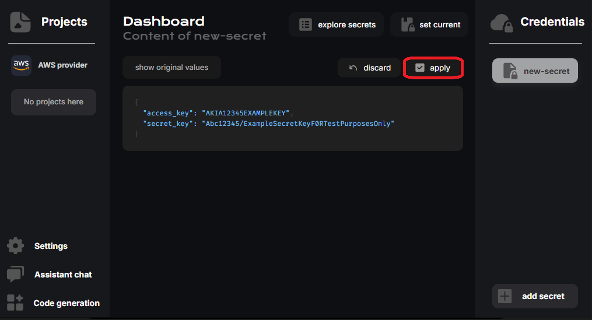

# ¿Cómo generar credenciales en AWS?  

Para acceder a AWS, se generan credenciales utilizando **Identity and Access Management (IAM)**.  

Las credenciales en AWS incluyen UNA clave de acceso y UNA clave secreta. Estas pueden ser creadas tanto por el usuario ROOT como por un usuario IAM.  

## Credenciales del usuario root (rápido)  

La forma más rápida de generar credenciales en los servicios de AWS es a través del usuario root, aunque no se recomienda su uso diario debido a preocupaciones de seguridad.  

::: warning  
El usuario root tiene acceso ilimitado a todos los recursos y servicios de AWS, lo que lo convierte en una opción poderosa pero riesgosa si se ve comprometido. Por esta razón, AWS recomienda encarecidamente utilizar el usuario root solo para la configuración de la cuenta o tareas que no pueden ser realizadas por usuarios o roles de IAM.  
:::  

1. Primero, accedé a la consola de IAM después de iniciar sesión.  

  

2. Una vez en el panel de control, dirigite a "Mis credenciales de seguridad".  

  

3. Desplazate hacia la sección de claves de acceso y hacé clic en "Crear clave de acceso".  

  

4. Ignorá la advertencia, seleccioná la casilla de verificación y hacé clic en "Crear clave de acceso".  

  

5. Copiá tanto la "clave de acceso" como la "clave secreta" antes de salir de la página.  

  

## Credenciales de usuario IAM (seguro)  

La forma más segura de generar credenciales en los servicios de AWS es a través de un usuario IAM, ya que tienen acceso limitado a la cuenta de AWS, lo que reduce el riesgo en caso de pérdida de credenciales.  

::: tip  
La manera más sencilla de otorgar acceso a un usuario IAM con control total sobre los recursos de la cuenta de AWS es mediante la política **AdministratorAccess**, la cual restringe operaciones críticas como la gestión de facturación o cuentas.  
:::  

1. Primero, accedé a la consola de IAM después de iniciar sesión.  

  

2. Ingresá a la sección de "Usuarios" desde el menú lateral izquierdo.  

  

3. Creá un nuevo usuario IAM para administración.  

  

4. Ingresá un nombre y una contraseña para el nuevo usuario y hacé clic en "Siguiente".  

  
  

5. Adjuntá la política **AdministratorAccess** al nuevo usuario y hacé clic en "Siguiente".  

::: info  
Esta política otorga acceso completo a todos los recursos y servicios de AWS. Si se asigna esta política al usuario, podrá realizar cualquier acción en cualquier servicio de AWS sin restricciones.  
:::  

  
  

6. Revisá los detalles finales y confirmá la operación.  

  

7. Volvé a la lista de usuarios y hacé clic en el nuevo usuario.  

  

8. En la pestaña "Credenciales de seguridad", hacé clic en "Crear clave de acceso".  

  
  

9. Elegí la opción "Interfaz de línea de comandos (CLI)", marcá la casilla y hacé clic en "Siguiente".  

  
  

10. Agregá una etiqueta descriptiva a las nuevas credenciales para identificarlas fácilmente y confirmá la operación.  

  

11. Copiá tanto la "clave de acceso" como la "clave secreta" antes de salir de la página.  

  

## Agregar credenciales en CloudStudio  

::: info  
Si ya tenés AWS CLI instalado y configurado (con las mismas credenciales obtenidas en los pasos anteriores), no es necesario cargarlas en las variables de entorno de CloudStudio.  
:::  

1. Accedé al proveedor de AWS en el panel de CloudStudio y hacé clic en "Agregar secreto".  

  

2. Copiá ambas claves, pegarlas en los campos "access_key" y "secret_key" y aplicá los cambios.  

  

3. Finalmente, asigná la clave creada al entorno de la aplicación actual.  

  
