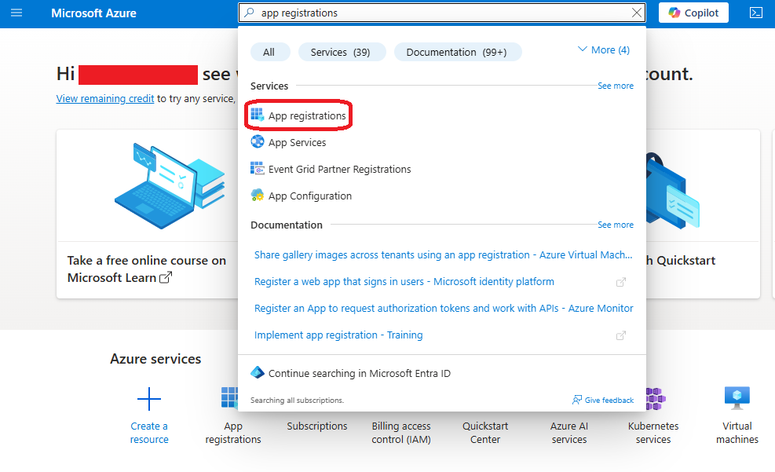
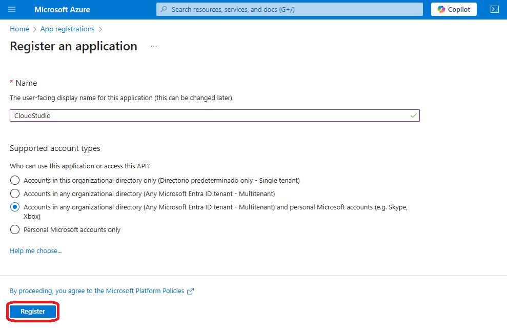
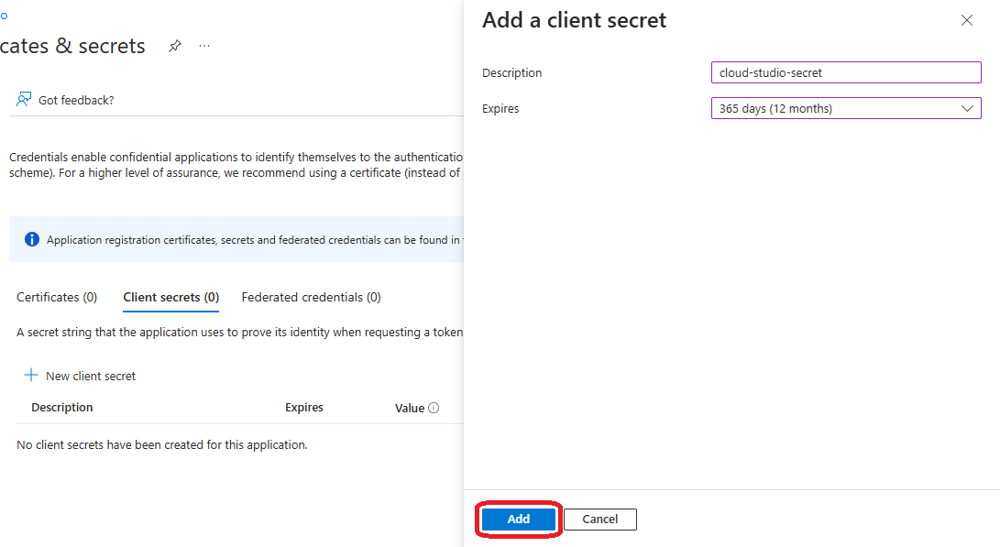
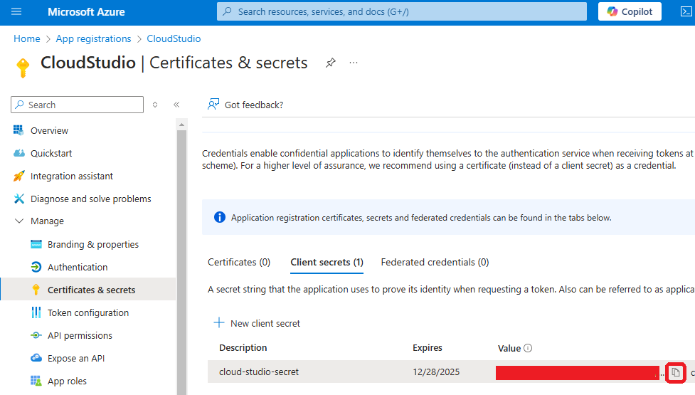
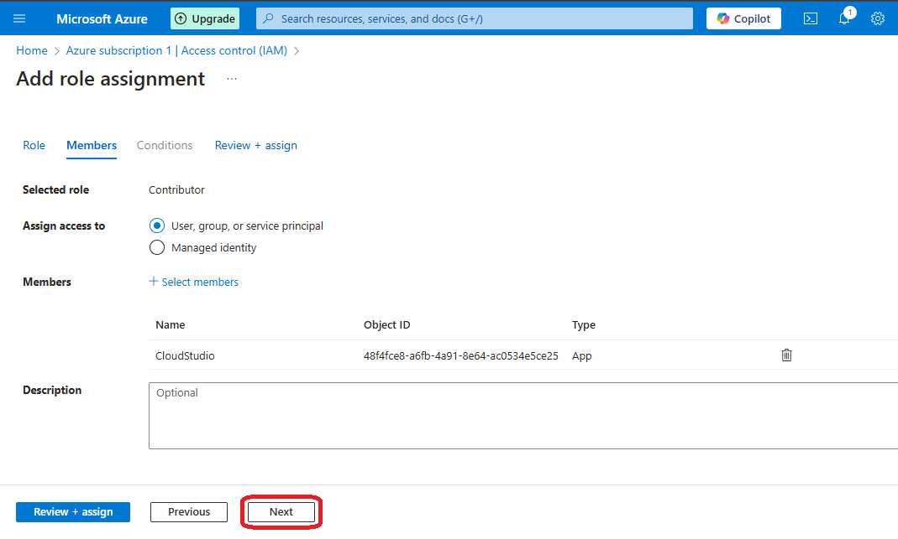
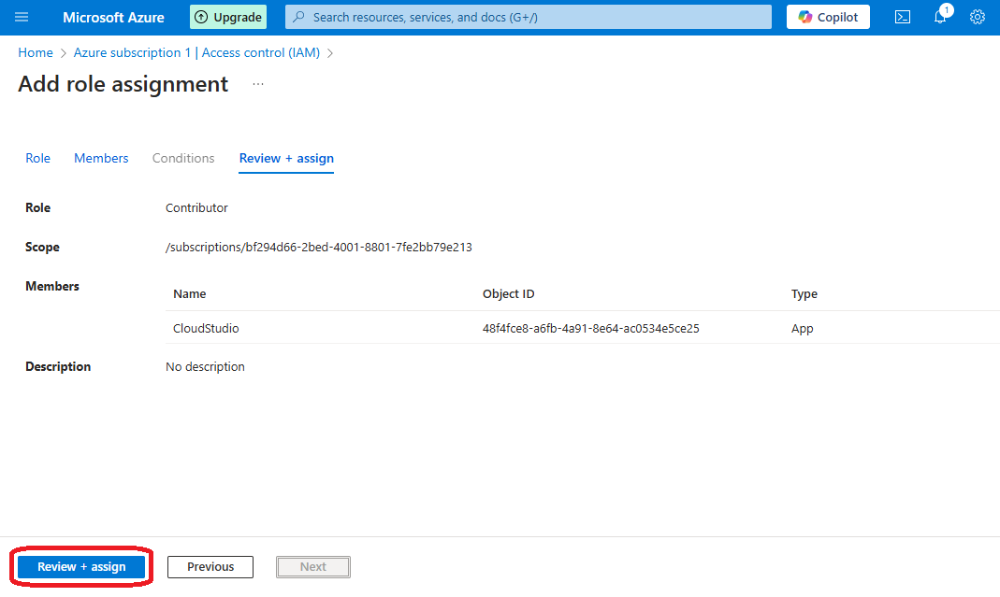
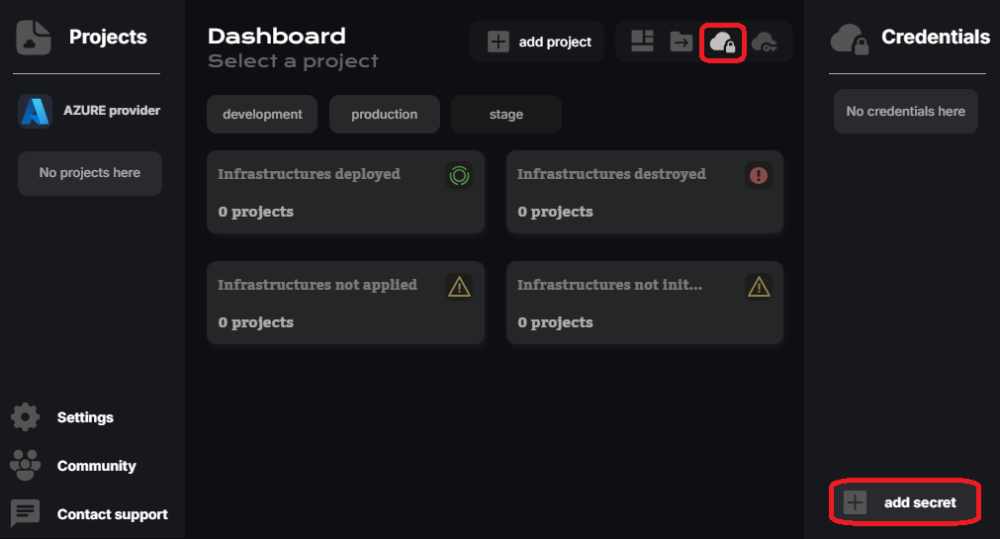

# ¿Cómo generar credenciales en AZURE?  

Para acceder a AZURE, se generan credenciales utilizando **Azure Active Directory (AAD)**.  

Las credenciales en AZURE incluyen CUATRO valores: un **client ID**, un **client secret**, un **tenant ID** y un **subscription ID**. El **subscription ID** puede ser intercambiado dentro de la misma conexión.  

## AAD y Suscripciones  

Azure Active Directory se usa para que aplicaciones externas (como CloudStudio) puedan acceder a los recursos de una cuenta de AZURE, controlando su acceso mediante roles y permisos.  

::: info  
Se crea una aplicación en AAD, que genera un **client_id** y permite configurar un **client_secret**.  
Además, esta aplicación está vinculada a un **tenant** específico identificado por el **tenant_id**.  

- Por otro lado, el **subscription_id** es un identificador único de una suscripción de Azure (que controla facturación, gestión de costos, acceso, permisos, etc.).  
:::  

1. Primero, ingresá a la consola de **App registrations** después de iniciar sesión.  

  

2. En la nueva consola, hacé clic en "New registration".  

  

3. Asignale un nombre, seleccioná "Accounts in any organizational directory" y hacé clic en "Register".  

  

4. Copiá el **Client ID** y el **Tenant ID** de la aplicación registrada.  

  

5. Luego, en el menú de la izquierda, andá a la opción "Certificates & Secrets".  

  

6. Hacé clic en el botón "New Client Secret".  

  

7. Ingresá una descripción y una duración para la nueva clave secreta, luego hacé clic en "Add".  

  

8. Copiá el **Client Secret** generado para la aplicación registrada.  

  

9. Volvé al panel principal de la plataforma y entrá en la sección **Subscriptions**.  

  

10. Hacé clic en una suscripción (seleccioná la predeterminada si no configuraste ninguna).  

  

11. Copiá el **Subscription ID**, que corresponde a la suscripción actual.  

  

::: info **Roles y Permisos**  
Para que la aplicación registrada y la suscripción elegida puedan conectarse a los recursos de Azure, la aplicación debe tener el rol de **CONTRIBUTOR** asignado en la misma suscripción.  

- **Después de copiar todas las claves y secretos, no van a funcionar hasta que la aplicación sea agregada como CONTRIBUTOR en la lista de asignaciones de roles del panel IAM de la suscripción.**  
:::  

12. En el menú de la izquierda, hacé clic en "Access control (IAM)".  

  

13. En la consola abierta, hacé clic en "Add" y luego en "Add role assignment".  

  

14. Seleccioná el rol **Contributor** en la sección "Privileged administrator roles" y hacé clic en "Next".  

  

15. Elegí la opción **"User, group or service principal"** y hacé clic en "Select members".  

  

16. Buscá y seleccioná la aplicación registrada anteriormente y hacé clic en "Select".  

  

17. Opcionalmente, agregá una descripción y hacé clic en "Next".  

  

18. Revisá toda la información y hacé clic en "Review + assign".  

  

## Agregar credenciales en CloudStudio  

::: info  
Si ya tenés instalado **AZURE CLI** y estás logueado (con el comando `az login`), no es necesario cargar las credenciales en las variables de entorno de CloudStudio.  

- Sin embargo, podrías querer agregar solo el **subscription_id**, ya que identifica una suscripción específica dentro de la cuenta y puede cambiar según las necesidades del proyecto.  
:::  

1. Accedé al proveedor de Azure en el panel de CloudStudio y hacé clic en "Add secret".  

  

2. Copiá las cuatro claves, pegarlas en los valores predeterminados y aplicá los cambios.  

  

3. Finalmente, asigná la clave creada al entorno de la aplicación actual.  

  
