# ¿Cómo generar credenciales en GCP?

Para acceder a GCP, se generan credenciales utilizando **Cuentas de servicio en la consola IAM**.

Las credenciales en GCP consisten en UN solo archivo en formato JSON que contiene toda la información necesaria para la autenticación.

## Proyecto and facturación

Los servicios en Google cloud están organizados en proyectos, cada proyecto tiene que tener su propio ID, cuenta de facturación y permisos para usar los recursos de GCP.

::: info
Cada proyecto usado para desplegar recursos tiene que tener una cuenta de facturación con un tarjeta de crédito enlazada a esta.
:::

1. Primero andá a **"Crear un proyecto"** en la consola después de iniciar sesión.

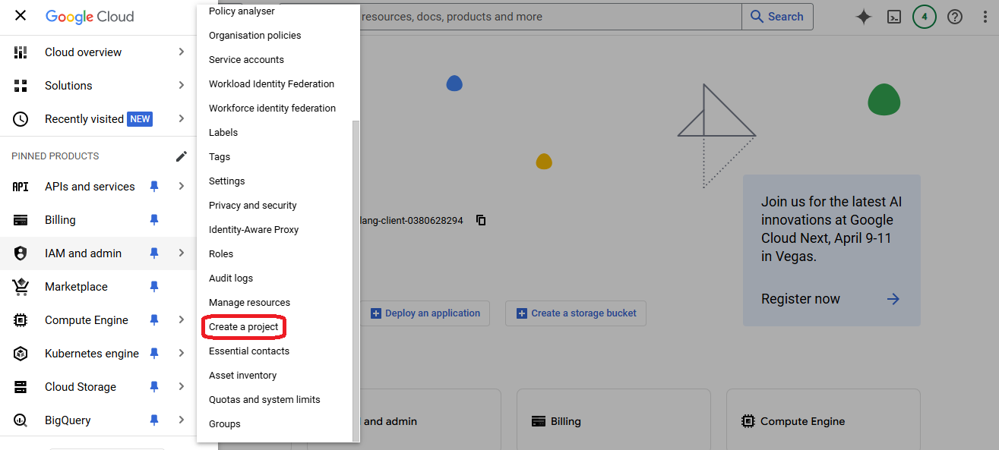

2. Elegí un nombre para el proyecto y un ID único (a usarse en CloudStudio)

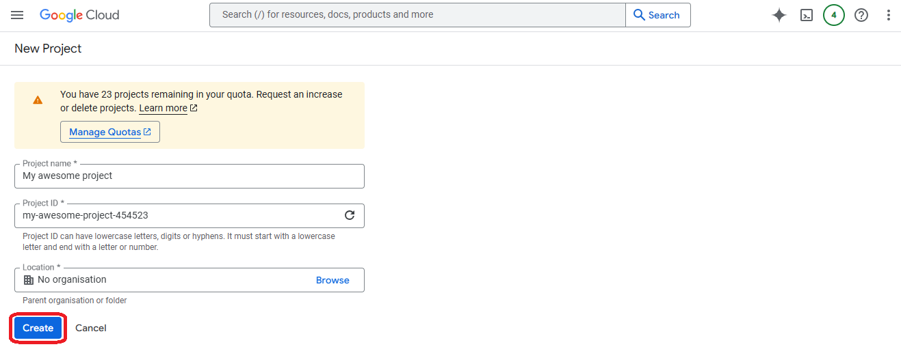

3. Andá a **"Facturación"** en el nuevo proyecto creado

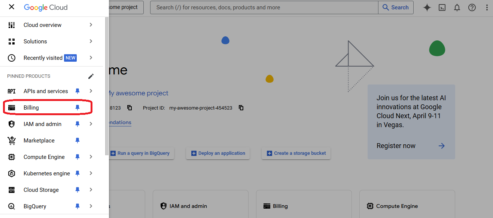

4. Andá a **"Administrar cuentas de facturación"** para crear una nueva cuenta

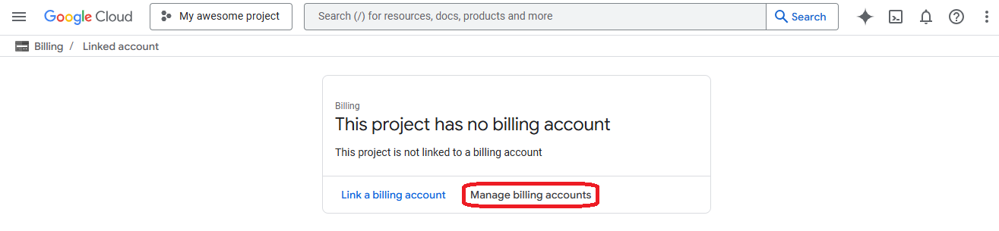

5. Hacé click en **"Crear cuenta"**

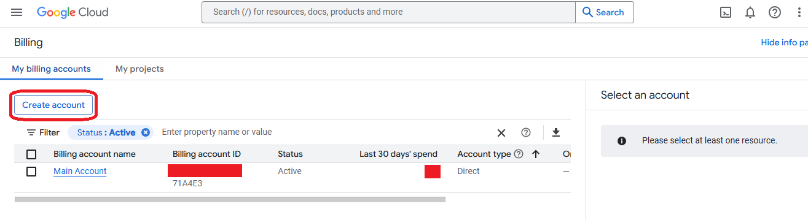

6. Elegí un nombre y un pais para la nueva cuenta y hacé click en **"Continuar"**

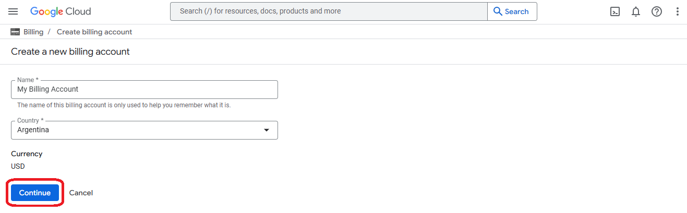

7. Agregá o elegí una tarjeta de crédito y hacé click en **"Enviar y habilitar facturación"**

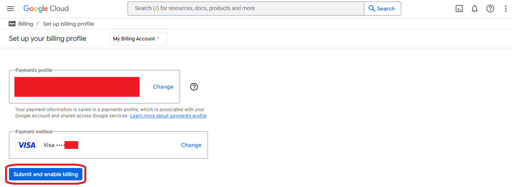

8. Creá una alerta de presupuesto en la nueva cuenta y volvé a **"facturación"**

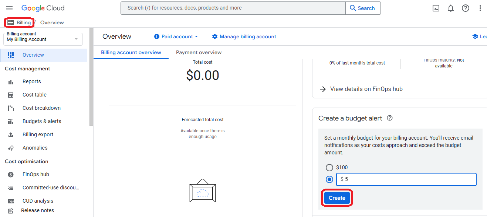

9. En la pestaña de **"Mis proyectos"** selecciona la acción **"Cambiar facturación"** en el nuevo proyecto

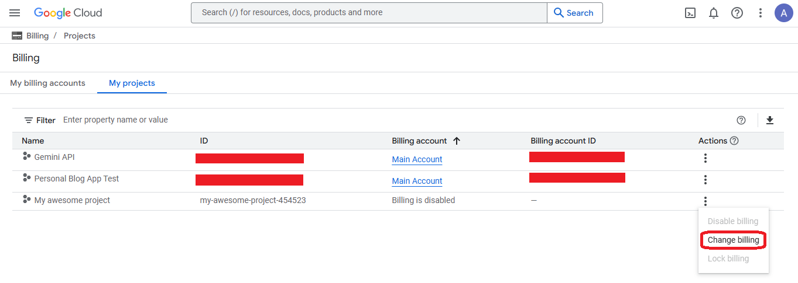

10. Seleeciona la nueva cuenta creada y hacé click en **"Establecer cuenta"**

## Claves de cuentas de servicio  

Las cuentas de servicio se utilizan para que aplicaciones externas (como CloudStudio) accedan a los recursos de una cuenta de GCP, controlando su acceso mediante roles y permisos.  

::: info  
Cada cuenta de servicio pertenece a un proyecto específico dentro de GCP, por lo que cada recurso creado a través de una cuenta de servicio existirá dentro de ese mismo proyecto. Para utilizar una cuenta de servicio, la aplicación externa se conectará a ella mediante un archivo JSON creado en la consola IAM y descargado en la máquina local.  
:::  

1. Primero, ingresá a la consola de **Cuentas de servicio** en el panel del nuevo proyecto.  

  

2. En la nueva consola, hacé clic en **"Crear cuenta de servicio"**.  

  

3. Asignale un nombre y una descripción adecuada.  

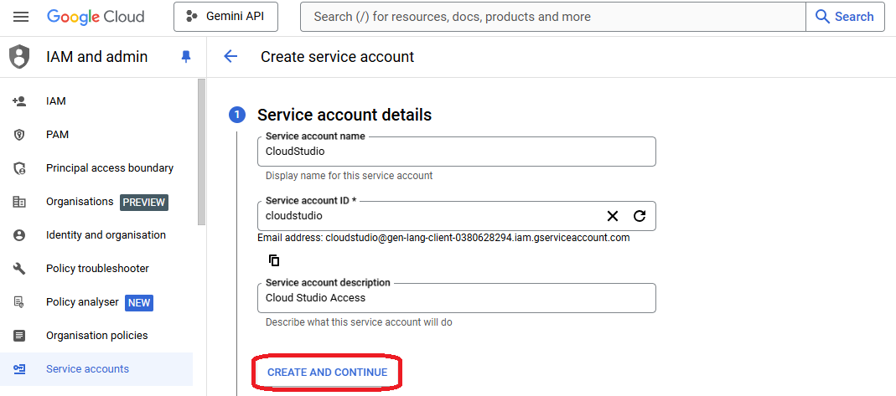  

4. Asignale el rol **"Owner"** para que pueda acceder a la mayoría de los recursos de GCP dentro de ese proyecto.  

  

5. Saltá el paso de **"Otorgar acceso a usuarios"** y confirmá la operación.  

  

6. Volvé a la lista de cuentas de servicio, seleccioná la recién creada y hacé clic en **"Administrar claves"**.  

  

7. Hacé clic en **"Agregar clave"** y luego en **"Crear nueva clave"**.  

  

8. Elegí el formato **JSON** y hacé clic en **"Crear"** para descargar el archivo de credenciales.  

  

## APIs y permisos de proyectos

Antes de empezar a trabajar con las nuevas credenciales, las APIs de cada servicio a desplegar tienen que estar habilitadas en el proyecto.

:::info
Las APIs para cada servicio Google de un proyecto pueden habilitarse o deshabilitarse en la libreria.
:::

1. Andá a la **"librería"** en la sección de APIs y servicios

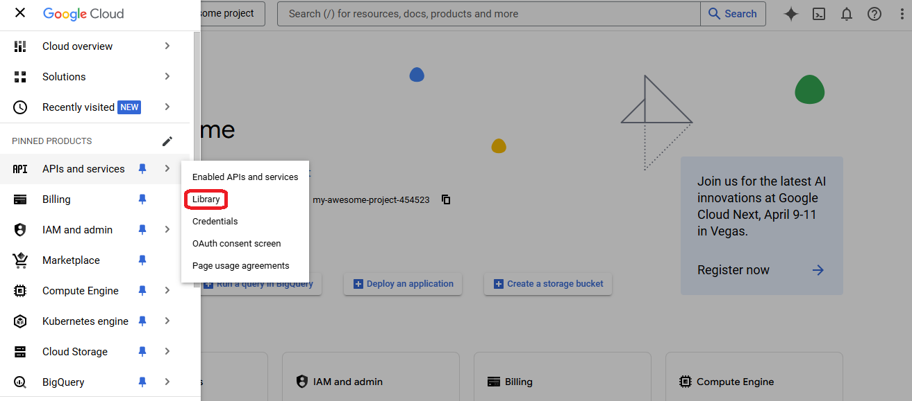

2. Buscá el servicio que querés desplegar en Google cloud

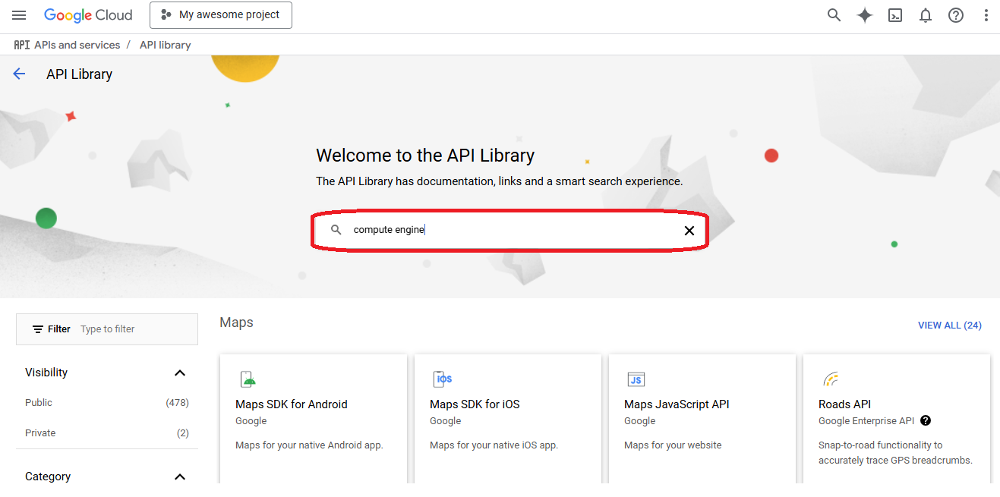

3. Seleccioná el servicio que estás buscando

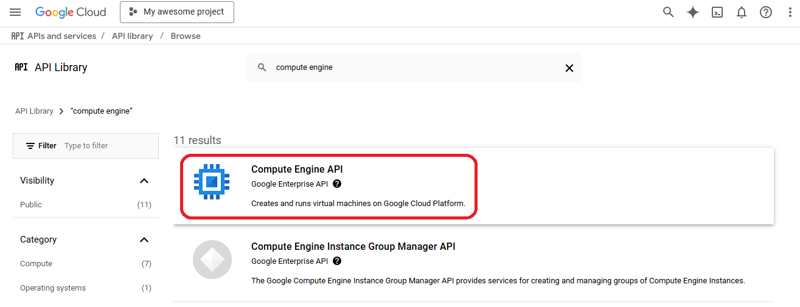

4. Hace click en **"habilitar"** y esperá a que tenga efecto

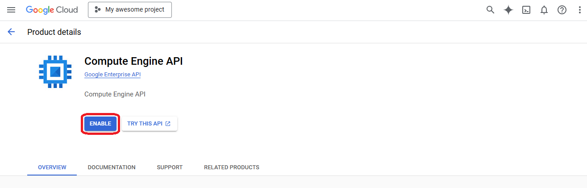

:::info
Adicionalmente si querés usar las credenciales generadas por un "Proyecto A" para desplegar recursos en un "Proyecto B" entonces vas a tener que agregar la misma cuenta de servicio con rol owner al "Proyecto B".
:::

1. Andá a la consola de **"IAM"** en el "Proyecto B" que querés enlazar a las credenciales del "Proyecto A"

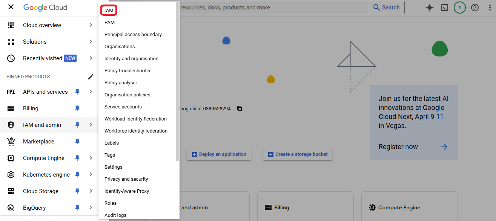

2. Hacé click en **"Otorgar acceso"**

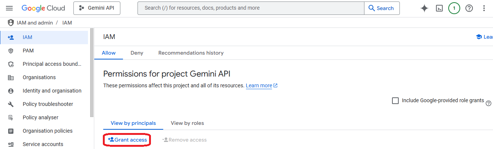

3. Selecciona el nombre de la cuenta de servicio del "Proyecto A" y dale el rol owner, guardalo

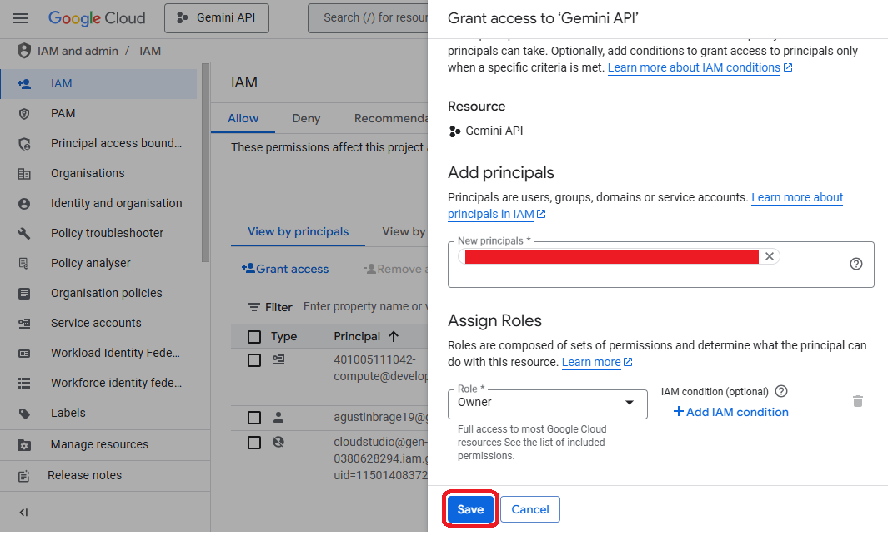

## Agregar credenciales en CloudStudio  

:::info  
Después de descargar el archivo JSON de credenciales, su contenido debería verse así:  
:::  

  

1. Accedé al proveedor de Google en el panel de CloudStudio y hacé clic en **"Agregar secreto"**.  

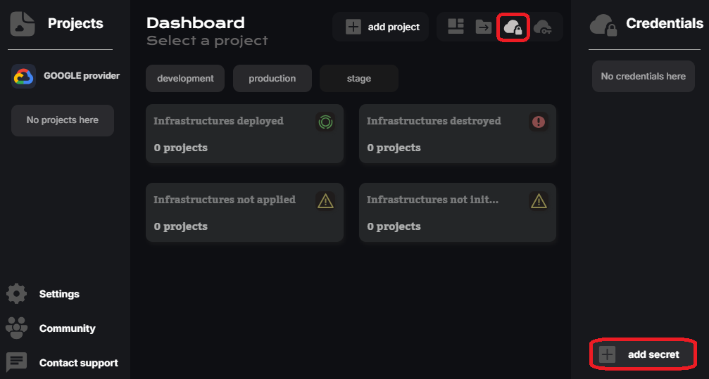  

2. Copiá la ruta del archivo JSON, pegala en el campo **app_credentials** y aplicá los cambios.  

  

3. Finalmente, asigná la clave creada al entorno de la aplicación actual.  

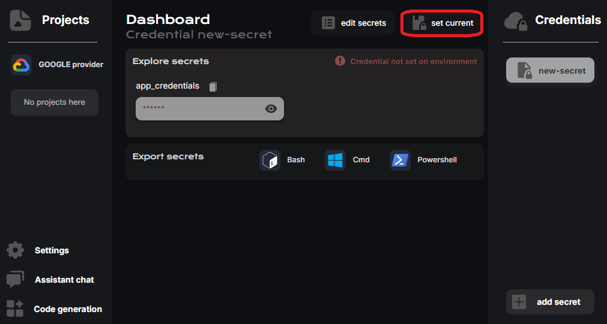  
