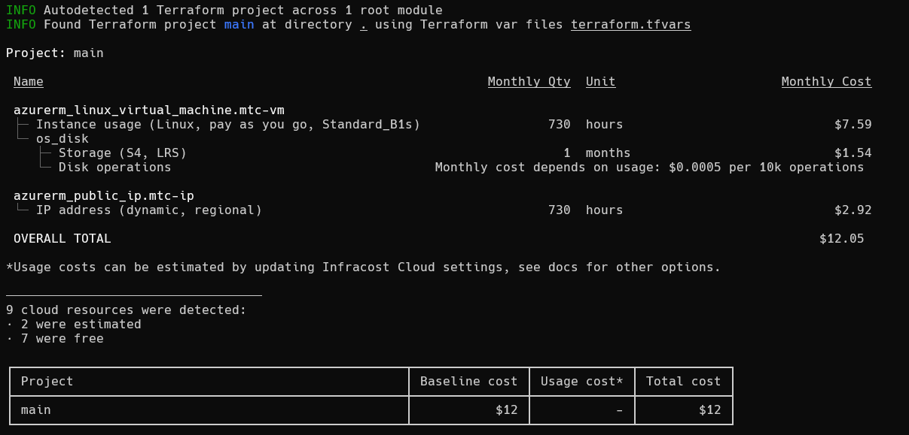

# Herramienta Infracost

CloudStudio utiliza Infracost como uno de sus componentes secundarios para funcionar.

**Debe ser instalado localmente para que CloudStudio pueda usarlo.**

:::info **Instalación**
[Infracost program](https://www.infracost.io/docs)
:::

:::info **Documentación oficial**
[Documentación de comandos Infracost](https://www.infracost.io/docs/features/cli_commands)
:::

## Vista general

Infracost es una herramienta de estimación diseñada para proveer visibilidad en los costos de la infraestructura en la nube durante la etapa del desarrollo y producción.

> Permite a los usuarios pronosticar y optimizar los gastos de la nube al integrarse directamente con flujos de trabajo de IaC (infraestructura como código) como Terraform.

## Características

- **`Estimación de costos en la Nube`**: Provee costos detallados para AWS, Azure, GCP, etc.
- **`Integración con Terraform`**: Se integra con Terraform estimando a partir de su código.
- **`Detección de Cambios`**: Identifica los cambios en los costos entre cambios en el código.
- **`Salida Legible`**: Genera un desglose de costos fácil de entender en formato JSON

## Ejemplo

Acá tenés un ejemplo básico de la salida de la ejecución de un comando Infracost

