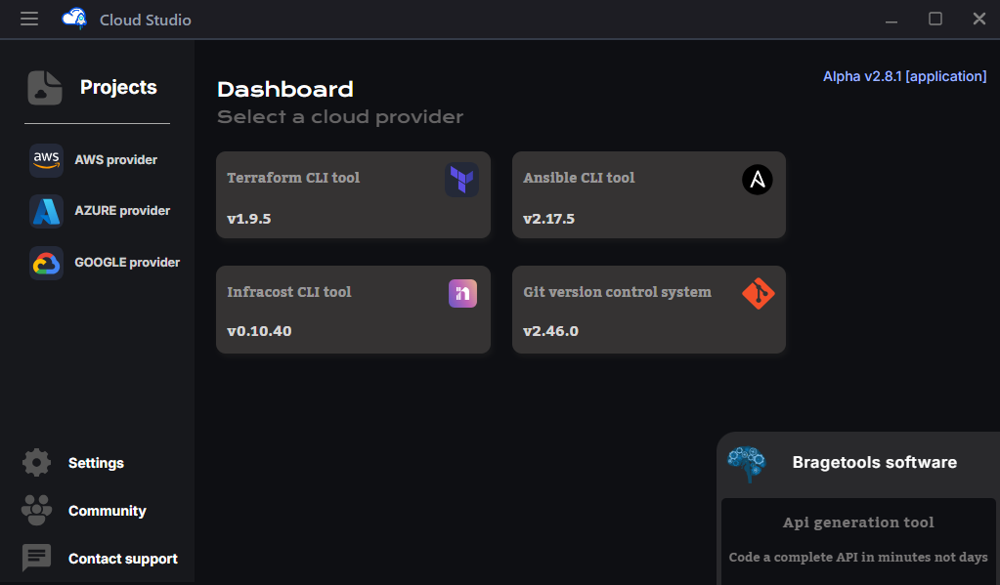

# Examples

The desktop application consists of an intuitive dashboard for seamlessly switching between `PROVIDERS`, `PROJECTS`, `MODULES`, `TEMPLATES`.

To see it in action check this [Video overview](https://www.youtube.com/watch?v=GYM_bfkdrZI).

## Providers

On the main dashboard you will find the state and version of the required tools for the app, as well as the **PROVIDERS** folders of the workdir on the sidemenu.

## Projects

When selecting a provider, a new view will open with all the projects on the sidemenu, and the status of the projects on the center *(deployed, destroyed, etc)*. 

> *And the botton icons on the top to go to templates, modules, secrets and keys.*

Once you select a project, it's gonna display the tfVars variable, and the buttons for running commands such as **apply**, **plan**, **destroy**, **ansible-playbook**, and more. 

> *Including (re)deploy project button which runs init, apply and ansible-playbook.*

## Code

On every project you can modify its code on its main files, modules and roles within the Terraform and Ansible code created automatically by the app. 

> *The app generates all the files and folders needed to start coding.*

## Executions

After starting the execution of a command, the modal is gonna open showing its output.

> *The execution can be canceled or minimized at any moment.*

## Breakdown

Additionally you can breakdown the project costs and estimitate its prices with Infracost.

> *On the breakdown it shows the base costs, usage costs and total costs per month.*

> *Also you can click in one price and see the processed JSON with all the information.*

