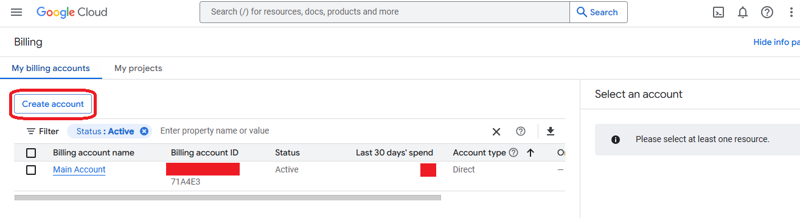
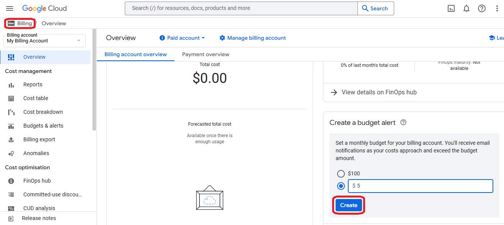
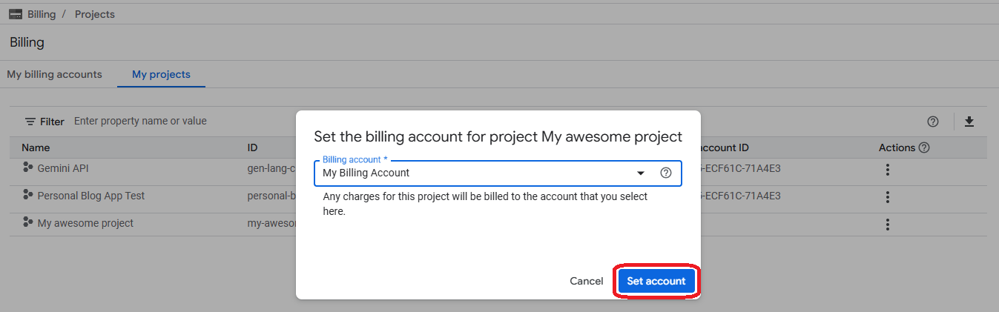
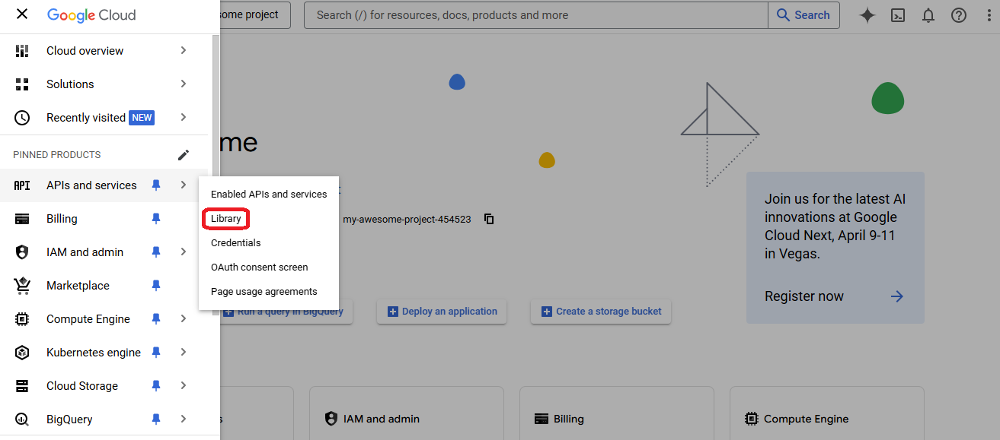
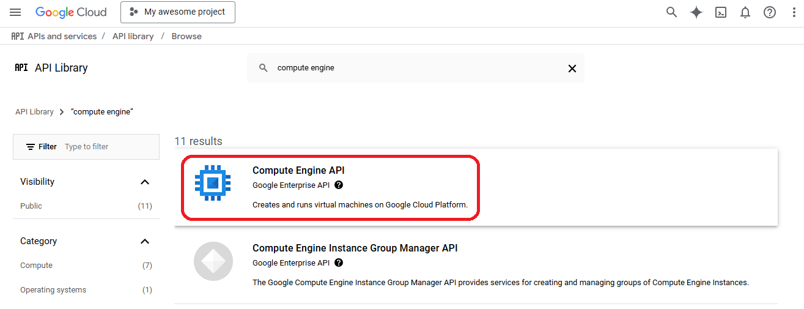
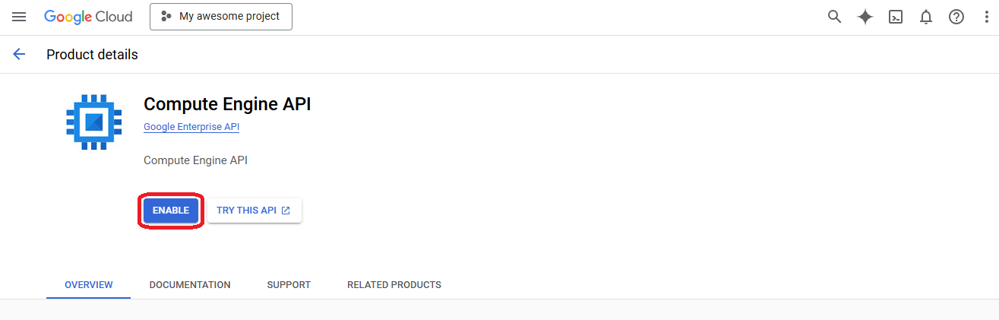

# How to generate credentials in GCP?

To access GCP, you generate credentials using **Service accounts on IAM console**.

The credentials in GCP include ONE single file in JSON format that contains all the neccessary information for authentication.

## Project and billing

The services in Google Cloud are organized in projects, each project has its own ID, billing account and permissions to use the GCP resources through service accounts.

::: info
Each project used to deploy resources has to have a billing account with a credit card attached. 
:::

1. First go to the "Create a project" console after logging in

2. Choose a project name and a unique project ID (to use it on CloudStudio)

3. Go to "Billing" on the new created project

4. Go to "Manage billing accounts" to create a new account

5. Click on "Create account"

6. Choose a name and a country for the new account and click on "Continue"

7. Add or choose a credit card and click on "Submit and enable billing"

8. Create a budget alert on the new billing account and go back to "billing"

9. On the tab of "My projects" select the "Change billing" action on the new project

10. Select the new account and click on "Set account"

## Service account keys

The service accounts are used for external applications (like CloudStudio) to access resources on a GCP account, controling its access through roles and permissions.

::: info
Every service account belongs to an specific project within GCP, so every resource created though a service account will live on that specfic project. To use a service account, the external app will connect to it by a JSON file created in the IAM console and downloaded on local machine.
:::

1. First go to the "Security accounts" on the new project dashboard

2. In the new opened console click "Create Service Account" 

3. Give it a name and appropriate description

4. Grant "Owner" role to access most GCP resources within that project

5. Skip the "Grant users access" step and confirm operation

6. Back to the Service accounts list, select the recently created and click "Manage Keys"

7. Click on the selector "Add Key" and then on the "Create New Key" option

8. Choose JSON format and click on "Create" to download the credentials file

## APIs and Project permissions

Before start working with the new credentials, the APIs of each service to be deployed have to be enabled on the project.

:::info
The APIs for each Google service of a project can be enable or disable on the library.
:::

1. Go to "library" in the APIs and services section

2. Search for the service you want to deploy on Google cloud

3. Select the service you are looking for

4. Click on "enable" and wait until it takes effect

:::info
Additionally if you want to use the credentials generated on "Project A" to deploy resources on "Project B" you'll need to add the same service account with owner role to "Project B".
:::

1. Go to "IAM" console on the "Project B" you want to link to the credentials of "Project A"

2. Click on "Grant access"

3. Select the name of the service account of "Project A" and give it an owner role, save it

## Add secrets to CloudStudio

:::info
After downloading the credentials JSON file, its content should look like this
:::

1. Go to the Google provider on the CloudStudio dashboard and click "add secret"

2. Copy the root to the JSON file, paste it on the app_credentials value and apply changes

3. Finally set created secret to the current app environment

