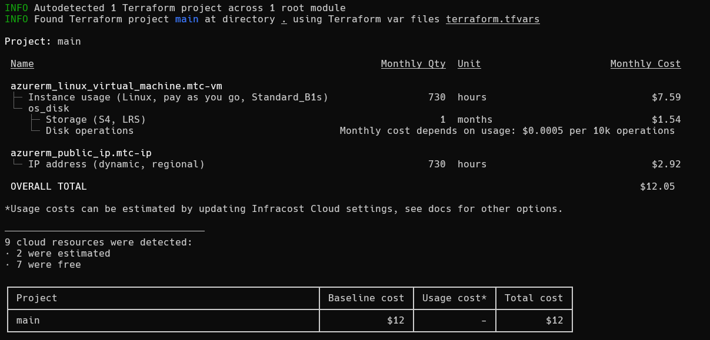

# Infracost tool

CloudStudio utilizes the Infracost program as one of its secondary components to complement its work.

**It must be installed on the machine so CloudStudio can use it.**

:::info **Installation**
[Infracost program](https://www.infracost.io/docs)
:::

:::info **Official Documentation**
[Infracost command docs](https://www.infracost.io/docs/features/cli_commands)
:::

## Overview
Infracost is a cost estimation tool designed to provide real-time visibility into cloud infrastructure costs during the development process.

> It empowers users to forecast and optimize cloud expenses by integrating directly with IaC (Infrastructure as Code) workflows like Terraform.

## Features
- **`Cloud Cost Estimation`**: Provides detailed cost insights for AWS, Azure, GCP, and more.
- **`Terraform Integration`**: Integrates with Terraform to estimate costs from its files.
- **`Drift Detection`**: Identifies cost changes between planned and deployed infrastructure.
- **`Human-Readable Output`**: Generates easy-to-understand cost breakdowns in JSON format

## Example

Here is a basic example of the output of a infracost CMD execution

